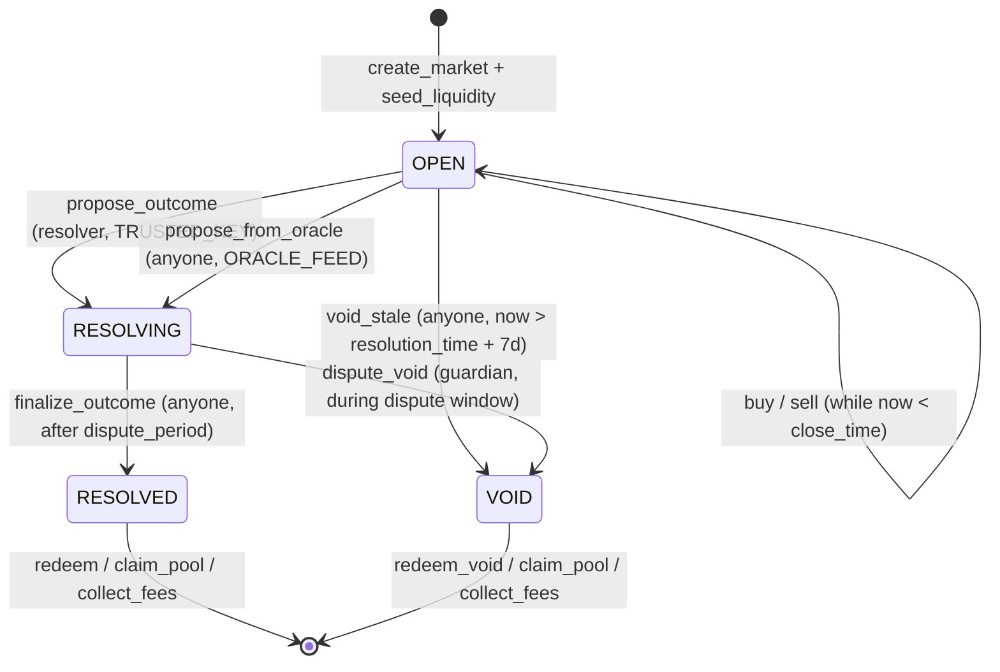

# Compute — Architecture

This document describes how the Compute prediction-market protocol is put
together: its components, the fixed-product market maker (FPMM) mechanism, the
on-chain account model and PDA layout, the resolution state machine, and the
event flow indexers rely on.

For an exhaustive, field-by-field surface map (every instruction, account,
error, and event) see [`REFERENCE.md`](REFERENCE.md). For the trust model and
known limitations see [`THREAT_MODEL.md`](THREAT_MODEL.md).

> **Authoritative PDA layout.** The PDA seeds and account model documented here
> (and in `REFERENCE.md`) describe the **shipped binary FPMM program**. They
> supersede the earlier, generic PDA sketch in `docs/RESEARCH.md` §7, which
> predates this program (it describes a conditional-token/scalar design that was
> not the one built). When the two disagree, **this document is correct.**

## 1. Components

| Component | Path | Role |
|---|---|---|
| **Anchor program** | `programs/compute-markets/` | The on-chain protocol: 21 instructions, the `Config`, `Market`, and `PriceFeed` accounts, the FPMM trade math, the settlement state machine (trusted-key **and** oracle-feed resolution), custody of collateral in PDA vaults. The load-bearing security surface. |
| **FPMM math** | `programs/compute-markets/src/math.rs` | Pure, dependency-free arithmetic for buy/sell quotes, fees, and marginal price. No Solana/Anchor types, so it is exhaustively unit- and property-tested on the host. All economically load-bearing rounding lives here. |
| **TypeScript SDK** | `sdk/` | PDA derivation, off-chain AMM quote helpers, a typed Anchor client, and the vendored IDL (`sdk/idl/`). |
| **Web app** | `app/` | Next.js frontend: wallet connect, trade/redeem flows. Ships its own vendored IDL copy (`app/lib/idl/`). |
| **Integration tests** | `tests/` | ts-mocha suite run against a real `solana-test-validator` (booted and torn down by `scripts/test-integration.sh`), asserting the conservation invariant end-to-end. |

The collateral token is any SPL mint chosen at `initialize` time (USDC in
production); collateral and outcome tokens use **6 decimals**
(`math::DECIMALS`).

## 2. The FPMM mechanism

Each market is **binary**: two outcome tokens, **YES** (`outcome = 0`) and
**NO** (`outcome = 1`), each redeemable for 1 unit of collateral if it is the
winning outcome. An automated market maker holds reserves `(r_yes, r_no)` of the
two outcome tokens and preserves the constant product `k = r_yes · r_no` across
trades. This is the Gnosis/Polymarket "split & swap" design.

### Split / merge

Collateral is converted to and from outcome tokens only as **full sets**:

- **Mint a full set:** `a` collateral in → mint `a` YES **and** `a` NO.
- **Burn a full set:** burn `a` YES **and** `a` NO → `a` collateral out.

Because every YES is matched 1:1 by a NO, `yes_supply == no_supply` always holds
while trading, and both equal `market.collateral`. This is what makes settlement
conserve: on a YES/NO resolution the winning-side supply equals
`market.collateral`; on a void each outcome token is worth exactly half of
collateral.

### Buy

`buy(outcome, collateral_in, min_tokens_out)`:

1. Take a protocol fee: `fee = floor(collateral_in · fee_bps / 10_000)`;
   `a = collateral_in − fee` is invested.
2. Mint a full set (`a` YES + `a` NO) into the pool.
3. Swap: return `y` of the bought side to the trader so the constant product is
   preserved. With `(reserve_bought, reserve_other)`:

   ```text
   keep = ceil(k / (reserve_other + a))      # bought reserve the pool retains
   y    = reserve_bought + a − keep          # tokens delivered to the trader
   ```

   New reserves: `reserve_bought' = keep`, `reserve_other' = reserve_other + a`.
4. Revert if `y < min_tokens_out` (slippage).

The fee is taken **before** the swap (off the gross `collateral_in`).

### Sell

`sell(outcome, collateral_out, max_tokens_in)`:

1. Compute the tokens the trader must return so the constant product is
   preserved. With `(reserve_sold, reserve_other)`:

   ```text
   need = ceil(k / (reserve_other − collateral_out))   # sold reserve required after
   r    = need + collateral_out − reserve_sold         # tokens the trader pays in
   ```

   Requires `collateral_out < reserve_other` (cannot drain the other reserve).
2. Revert if `r > max_tokens_in` (slippage).
3. Trader returns `r` of the sold side to the pool; the pool merges a full set
   (`collateral_out` YES + `collateral_out` NO) out, burning it.
4. Take a fee off the gross: `fee = floor(collateral_out · fee_bps / 10_000)`;
   the trader receives `collateral_out − fee`.

The fee is taken **after** the swap (off the gross `collateral_out`).

### Rounding policy (safety critical)

Every rounding decision is made so the pool's constant product **never
decreases**. Concretely, the reserve the pool *keeps* is rounded **up** (`ceil`),
so the trader receives slightly fewer tokens on a buy and pays slightly more on a
sell. This guarantees `r_yes' · r_no' ≥ r_yes · r_no` and prevents value leaking
out of the pool through repeated trades. The property tests assert this directly,
along with no-underflow, round-trip non-profitability, and ceil-tightness.

Marginal price (probability) of an outcome is `other_reserve / (self_reserve +
other_reserve)`, scaled by 1e6 (`marginal_price_micro`); buying a side raises its
price.

## 3. Account model

Three account types, all Anchor-owned:

- **`Config`** — one per deployment. Holds `admin`, `pending_admin`, `guardian`,
  the `collateral_mint`, `fee_bps`, `dispute_period`, a monotonic `market_count`,
  the global `paused` flag, and the PDA bump.
- **`Market`** — one per market. Holds identity (`market_id`, `creator`,
  `resolver`, `resolver_kind`), the **oracle config** (`oracle_feed`,
  `oracle_strike`, `oracle_comparison`, `oracle_max_staleness`, used when
  `resolver_kind == ORACLE_FEED`), the token wiring (`collateral_mint`, `yes_mint`,
  `no_mint`, `vault`, `pool_yes`, `pool_no`), the AMM state (`reserve_yes`,
  `reserve_no`, `lp`, `lp_shares`), the accounting (`collateral`, `fee_accrued`),
  the lifecycle (`state`, `outcome`, `proposed_outcome`, `close_time`,
  `resolution_time`, `resolved_at`), the display strings (`question`,
  `resolution_source`), and **64 reserved bytes** of forward-compat padding for
  future oracle resolver configs.
- **`PriceFeed`** — a generic on-chain numeric feed (not a PDA; a fresh
  keypair-owned account). Holds `authority`, `value`, `decimals`, `published_at`,
  and a `description`. Read by `RESOLVER_ORACLE_FEED` markets to resolve; posted to
  by a Switchboard On-Demand Function or a committee multisig. See
  [`ORACLE.md`](ORACLE.md).

The `Market` PDA is the **mint authority** of `yes_mint`/`no_mint` and the
**token authority** of `vault`/`pool_yes`/`pool_no`; it signs all mint, burn, and
transfer CPIs with its seeds. Holding both authorities at the Market PDA is what
lets the program move funds without any external signer.

### Conservation invariant

At all times:

```text
vault balance == market.collateral + market.fee_accrued
```

`collateral` backs outstanding outcome tokens; `fee_accrued` is the protocol's
fee bucket. They are tracked as independent counters; `collect_fees` only ever
moves the fee bucket and cannot touch collateral backing.

### PDA table

All PDAs are derived from the program ID. `market_id` is encoded **little-endian
u64**; `market` below means the Market account's own pubkey.

| Account | Seeds | Authority / notes |
|---|---|---|
| `Config` | `["config"]` | Singleton global config. |
| `Market` | `["market", market_id (u64 LE)]` | One per market; `market_id` comes from `config.market_count`. |
| `yes_mint` | `["yes", market]` | Mint authority = Market PDA; 6 decimals. |
| `no_mint` | `["no", market]` | Mint authority = Market PDA; 6 decimals. |
| `vault` | `["vault", market]` | Token account holding collateral; authority = Market PDA. |
| `pool_yes` | `["pool_yes", market]` | AMM reserve of YES tokens; authority = Market PDA. |
| `pool_no` | `["pool_no", market]` | AMM reserve of NO tokens; authority = Market PDA. |

The `vault`/`yes_mint`/`no_mint` are created at `create_market`; the
`pool_yes`/`pool_no` are created at `seed_liquidity`.

## 4. Resolution state machine

States (`market.state`): `OPEN = 0`, `RESOLVING = 1`, `RESOLVED = 2`,
`VOID = 3`. Outcomes: `YES = 0`, `NO = 1`.



Lifecycle in words:

1. **`initialize`** (once per deployment) sets up `Config`.
2. **`create_market`** mints the YES/NO mints and the vault, records `close_time
   <= resolution_time`, the `resolver`, and `resolver_kind` — either
   `TRUSTED_KEY` (default) or `ORACLE_FEED` (with `oracle_feed` / `oracle_strike` /
   `oracle_comparison` / `oracle_max_staleness`, validated per kind).
3. **`seed_liquidity`** (creator, once) deposits collateral, mints equal YES/NO
   into the pools at 50/50, and opens trading.
4. **`buy` / `sell`** run while `now < close_time` and not paused.
5. **Step 1 of resolution → `RESOLVING`** at/after `resolution_time`, via one of
   two paths depending on `resolver_kind` (both record `proposed_outcome` +
   `resolved_at`; **payouts stay locked**):
   - **`propose_outcome`** (`TRUSTED_KEY`) — the `resolver` key proposes a winning
     outcome.
   - **`propose_from_oracle`** (`ORACLE_FEED`, **permissionless**) — derives the
     outcome from the bound `PriceFeed` (see the subsection below).
6. **Dispute window** of `config.dispute_period` seconds:
   - **`finalize_outcome`** (permissionless) after the window → `RESOLVED`.
   - **`dispute_void`** (guardian) during the window → `VOID` (reason `DISPUTE`).
7. **`void_stale`** (permissionless) — if the resolver never proposed and
   `now > resolution_time + VOID_GRACE_PERIOD` (7 days), anyone may move an
   `OPEN` market straight to `VOID` (reason `STALE`).
8. **Payout:** `RESOLVED` → `redeem` (winning token 1:1) / `claim_pool` (LP
   reclaims winning reserve); `VOID` → `redeem_void` (either token, half
   collateral each) / `claim_pool` (LP reclaims half of each reserve).
   `collect_fees` (admin) works in either terminal state.

This is the "defense in depth" design: the resolver only *proposes*, a timelock
delays payout, a guardian can veto, and a liveness hatch guarantees collateral is
never permanently stranded. See [`THREAT_MODEL.md`](THREAT_MODEL.md).

### Oracle resolution path

A `RESOLVER_ORACLE_FEED` market is proposed by `propose_from_oracle` instead of
`propose_outcome`. The two instructions are interchangeable **only** at step 1 of
resolution: both feed the *same* `RESOLVING` state, the *same* dispute window, and
the *same* `finalize_outcome` / `dispute_void` exits — the only difference is where
the proposed outcome comes from.

`propose_from_oracle` is **permissionless** (any cranker may call it). At/after
`resolution_time` it reads the bound `PriceFeed` (validated by `address =
market.oracle_feed`), rejects an unpublished (`FeedHasNoValue`) or stale
(`now - published_at > oracle_max_staleness` → `StaleFeed`) feed, then derives the
outcome by comparing `feed.value` to `oracle_strike` under `oracle_comparison`
(`CMP_GTE` ⇒ YES iff `value >= strike`; `CMP_LTE` ⇒ YES iff `value <= strike`) —
exact integer math, boundary inclusive. It sets `state = RESOLVING`, records
`resolved_at`, and emits `OutcomeProposed` with the **feed pubkey** as the nominal
`resolver`. The complementary `init_price_feed` / `publish_price` instructions
create and post to the feed. Because the oracle proposal still passes through the
dispute window, the guardian can `dispute_void` a manipulated feed — the trust on a
feed rests on its `authority` (a Switchboard On-Demand Function enclave or a
committee multisig), not a single resolver key. The program reads a first-party
`PriceFeed`; it does not parse Switchboard's native account. Full design,
manipulation analysis, and a worked example are in [`ORACLE.md`](ORACLE.md).

## 5. Event flow for indexers

Every state-changing instruction emits an Anchor event (CPI log). An indexer
(e.g. Helius webhooks / LaserStream) can reconstruct full market state and
reconcile balances from these alone:

| Event | Emitted by | Key fields |
|---|---|---|
| `MarketCreated` | `create_market` | `market_id`, `market`, `creator`, `resolver`, `close_time`, `resolution_time` |
| `LiquiditySeeded` | `seed_liquidity` | `market`, `amount` |
| `TradeExecuted` | `buy` / `sell` | `market`, `user`, `is_buy`, `outcome`, `collateral` (gross), `tokens` |
| `OutcomeProposed` | `propose_outcome` / `propose_from_oracle` | `market`, `resolver` (the feed pubkey on the oracle path), `outcome`, `proposed_at` |
| `MarketResolved` | `finalize_outcome` | `market`, `outcome`, `resolved_at` (finalize time) |
| `MarketVoided` | `dispute_void` / `void_stale` | `market`, `reason` (`0 = DISPUTE`, `1 = STALE`) |
| `Redeemed` | `redeem` / `redeem_void` | `market`, `user`, `amount` (tokens burned), `payout` (collateral out) |
| `PoolClaimed` | `claim_pool` | `market`, `lp`, `payout` |
| `FeesCollected` | `collect_fees` | `market`, `amount` |
| `PausedSet` | `set_paused` | `paused` |
| `PriceFeedInitialized` | `init_price_feed` | `feed`, `authority` |
| `PricePublished` | `publish_price` | `feed`, `value`, `published_at` |

Notes for indexers:

- `TradeExecuted.collateral` is the **gross** amount (the user's `collateral_in`
  on a buy / `collateral_out` on a sell), not net of fees.
- The dispute window opens at `OutcomeProposed.proposed_at` and lasts
  `config.dispute_period`; finalization is only valid at/after
  `proposed_at + dispute_period`.
- A market reaching `MarketVoided` after `OutcomeProposed` is a guardian veto;
  one reaching it from `OPEN` with `reason = STALE` is the liveness hatch.
- To track the conservation invariant off-chain, sum `TradeExecuted` deltas plus
  `LiquiditySeeded`, `Redeemed.payout`, `PoolClaimed.payout`, and
  `FeesCollected.amount` against the vault balance.
